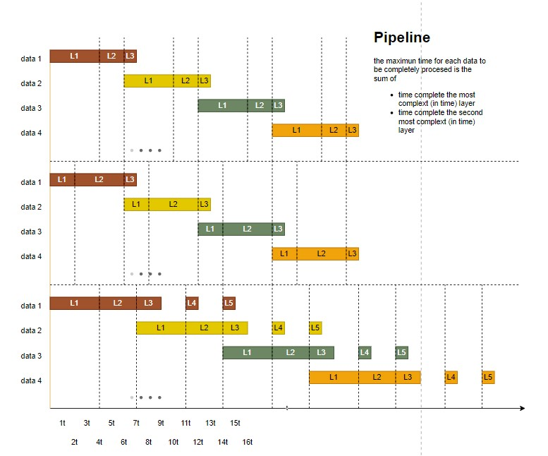

# - `Implementacion de una Red Neuronal Densa en FPGA`
- __Universidad__: Universidad de Buenos Aires (UBA).
- __Proyecto__: _Implementacion de una Red Densa en FPGA_.
- __Materiales__: ArtyZ7-10, laptop y cable micro-usb.
- __entorno__: Vivado 2023 y Vitis 2023.
- __hardware description lenguaje__: Verilog.

# - ``Estructura del repositorio``
```.
├── README.md
├── diagrams.drawio                       (diagramas usados en este README)
├── imagenes
└── vivado  
    ├── p_memory_design                   (proyecto en vivado con la implementacion de los bloques en verilog)
    │   ├── project_8.srcs
    │   │   ├── sim_1                     (simulaciones)
    │   │   │   └── new
    │   │   │       ├── calculateWeight2_tb.v
    │   │   │       ├── calculateWeight_tb.v
    │   │   │       ├── calculateY_tb.v
    │   │   │       ├── mxn_tb.v
    │   │   │       ├── qqq.v
    │   │   │       ├── t_mainController.v
    │   │   │       └── weight2.v
    │   │   └── sources_1
    │   │       ├── bd
    │   │       │   └── design_1
    │   │       │       ├── design_1.bd
    │   │       │       ├── design_1.bda
    │   │       │       ├── ip
    │   │       │       └── ui
    │   │       │           └── bd_1f5defd0.ui
    │   │       └── new                   (hardware)
    │   │           ├── calculateY.v
    │   │           ├── datapath.v
    │   │           ├── eeeee.v
    │   │           ├── mainController.v
    │   │           ├── mxn.v
    │   │           ├── weight3.v
    │   │           └── weightPointer.v
```
# - `Puntos de mejora` 
- optimamente los datos de entrada deberian almacenarce en una memoria y ser consumidas directamente. Esto evitaria que tengamos que cargar dato por dato desde el microcontrolador.
- los pesos deberian estar almacenados en memoria debido a la cantidad que registros que serian necesarios de nos ser asi y a la cantidad limidad de los mismos que la tarjeta Arty zy tiene. 
# - `Background y notacion`
Esta es la notacion que seguiremos a lo largo del proyecto:
- __x<sub>4</sub>__ es la cuarta neurona de la capa de entrada
- __y<sup>(2)</sup><sub>4</sub>__ es la curta neurona de la capa dos de la red
- __w<sup>(3)</sup><sub>ij</sub>__ es el peso que conecta a la neurona __y<sup>(2)</sup><sub>i</sub>__ con __y<sup>(3)</sup><sub>j</sub>__


# - `Diseño y funcionamiento`

## -- `Vista general`

el FPGA interactuara con el microcontrolador a traves de 4 medios: 
  - __address__
  - __enableWrite__
  - __input data__
  - __output data__
  - __networkEnd__
  - __networkStart__

Las señales __enableWrite__, __address__ e __input data__ trabajaran en conjunto para cargar los datos de la capa input de la red. Una vez cargada, se dara inicio al proceso con la señal __networkStart__. Cuando finalice el proceso, el FPGA activara el flag __networkEnd__ y el dato de salida estara listo en el bus __output data__.


## -- `registers`
Los datos seran almancenados principalmente en los siguientes bloques de registros:
- __weight global registers__ 
- __neuron global registers__
- __layer registers__ (one by layer)

Los __global registers__ son accedidos por todas las capas. Los __layer registers__ son accedidos solo por la capa que lo contiene. 

La siguiente imagen muestra como estarian cargados los pesos y la salida de cada neurona en una red de dimensiones 3x3x2x1.


## -- `main controller`
El __main controller__ sera el encargado de gestionar todo el proceso interno de de la red. Se encargada de activar capa por capa de acuerdo a la arquitectura pipeline que se esta siguiendo. 


La forma en la que activara las capas estara definida por la arquitectora pipeline que se esta siguiendo

## -- `arquitectura de capa`
Para poder habilitar el pipeline, cada capa tendra que tener su propio juego de punteros 
- weight pointer
- previous y pointer
- y pointer


El funcionamiento de la capa estara definido por su unidad de control (__layer controller__):
- la capa estara en estado __waiting__ mientras espera la señal de inicio. 
- una vez se de inicio a la capa, se resetearan todas las flags internas.
- se pedira al controlador __mxn controller__ informacion si es que la neurona o si la capa ha llegado a su fin. 
- en base a la respuesta del __mxn controller__, se activaran los controladores __weight pointer controller__, __y pointer controller__ y __previous y pointer controller__.
- el __layer controller__ tambien gestionara cuando se active o se desactive el acumulador.


## -- `pipeline`
- Nuestra arquitetura sera basada en pipeline para mejorar el tiempo de procesasamiento de la red. 
- El tiempo maximo para obtener un resultado es la suma de las dos capas que le toma el mayor tiempo de procesamiento individual. 



- El pipeline tendra en un desfase de 2 para evitar el overwriting de los __y__.


# - Implementacion en Vivado

## -- Red neuronal
nuestra red neuronal consta de tres bloques de hardware: 


### --- deco
se usa para poder cargar de forma serial los datos en la capa 1 de la red


### --- memoria
contiene la representacion en hardware de las 3 capas.


### --- axi_4_lite_inst
es la interfaz AXI4LITE del hardare. Nos sive para comunicar nuestra red con el procesador. Para poder crearlo usamos el archivo proveido por Vivado y hacemos modificaciones para permitir datos de entrada y salida.
  - Tools
  - Create and Package New IP
  - Next
  - Create a new AXI4 peripheral
  - Next 
  - Next (completar campos de ser necesario)
  - Next
  - Edit IP
  - Finish

Comparto el codigo para que se tenga como referencia.


## -- AXI GPIO button

Se configura el bloque __AXI GPIO__ de la siguiente forma. Al conectarlo al __ZYNQ7__ automaticamente se le asigna la direccion __0x4120_0000__ 


## -- Bloque completo
Se usan los siguientes bloques en la vista diseño de Vivado:

- ZYNQ7 Processing System (del IP catalog)
- AXI GPIO (del IP catalog para los leds)
- AXI GPIO (del IP catalog para los botones)
- red (diseño propio)
- AXI interconect (creado de manera automatica)
- Processor System Reset (creado de manera automatica)

Dejar que VIvado haga todas las conexiones automaticamente.


Considerar el siguiente direccionamiento AXI4 lite


# - Implementacion en Vitis
Crear una plataforma y llamarle __plataforma__. Luego crear una desde la plataforma creada y ponerle __aplicacion__

Se usa como proyecto base el brindado por __Vitis__. Seguir la siguiente ruta para crearlo:
- __platform.spr__
- __Board Support Package__ (dentro de folder __standalone on ps7_cortexa9_0__)
- __Import Examples__ (al costado de __axi_gpio_0__)


El software consiste de tres etapas:
- __primera etapa__: se obtiene los datos del exterior. Para este proyecto se uso los botones de la placa para simular un sensor exterior. Se usa a funcion __XGpio_DiscreateRead__ para obtener los datos externos.


- __segunda etapa__: los datos obtenidos desde el exterior son cargados a un arreglo logico para poder cargarlos a posterior en la red.


- __Tercera etapa__: Se realiza la alimentacion de la red. Para ello hay que brindarle a la red dos datos: __direccion__ y __dato__.


# - Uso

Ingresar al entorno de Vitis. Abrir una terminal serial.


Abrir una terminal. Presionar los botones de la tarjeta ArtyZ7-10


Presionar los botones y veremos que se modica el resultado.


# - Referencia (what, where, who)
- Network notation, __https://deeplearning.cs.cmu.edu/F22/document/slides/lec5.learning.pdf__, _Carnegie Mellon University_
- Verilog code for diferent hardware implementations, __ISBN 10: 1-292-23116-5 ISBN 13: 978-1-292-23116-7__, _Digital Design book_
- Pipeline, __ISBN: 978-0-12-800056-4__, _Digital Design and Computer Arquitecture book_