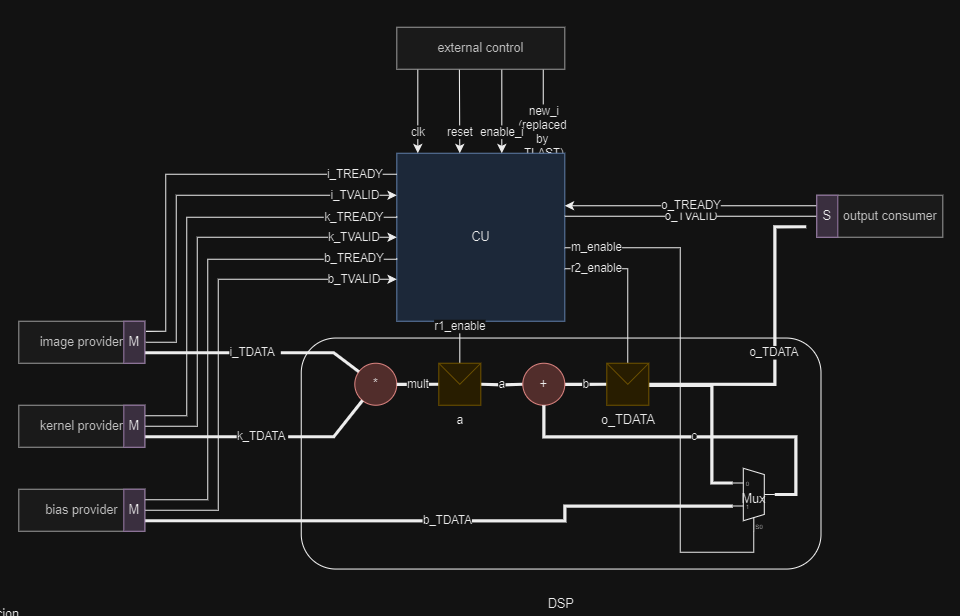
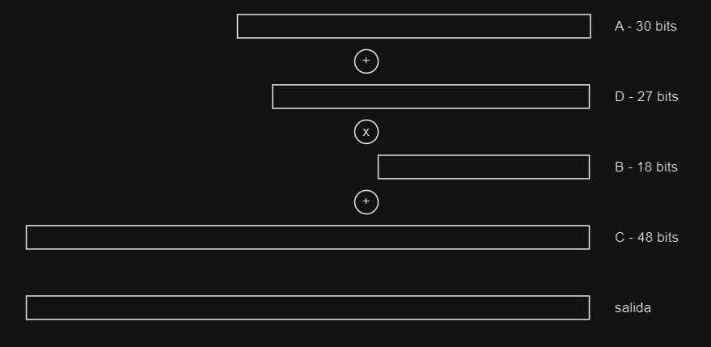
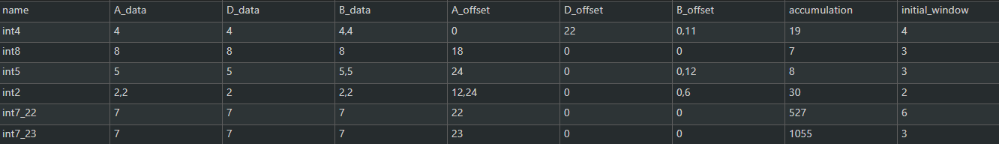
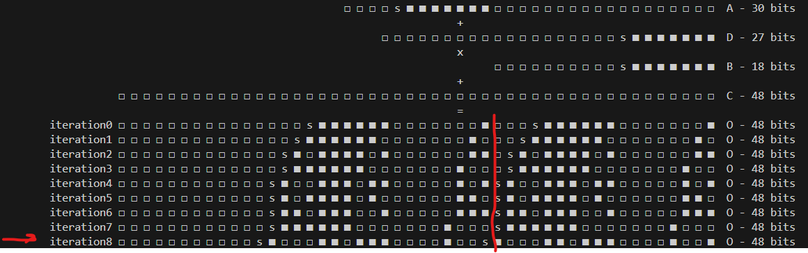
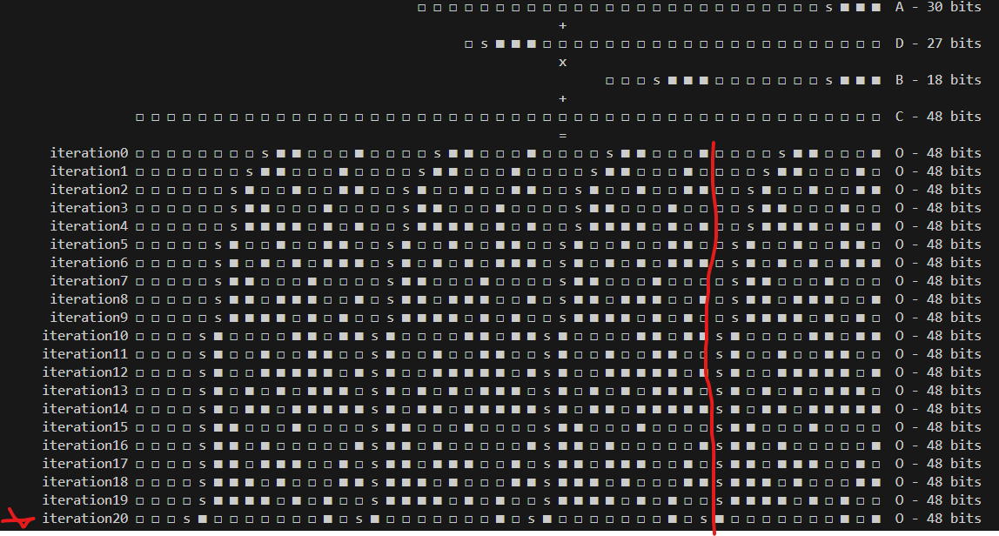
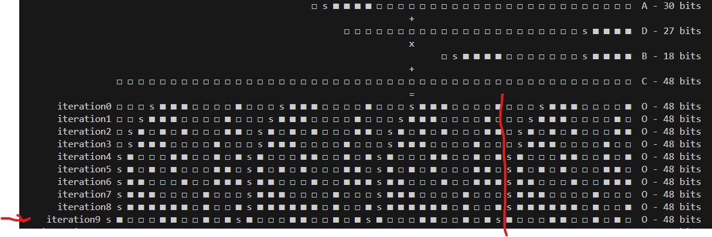
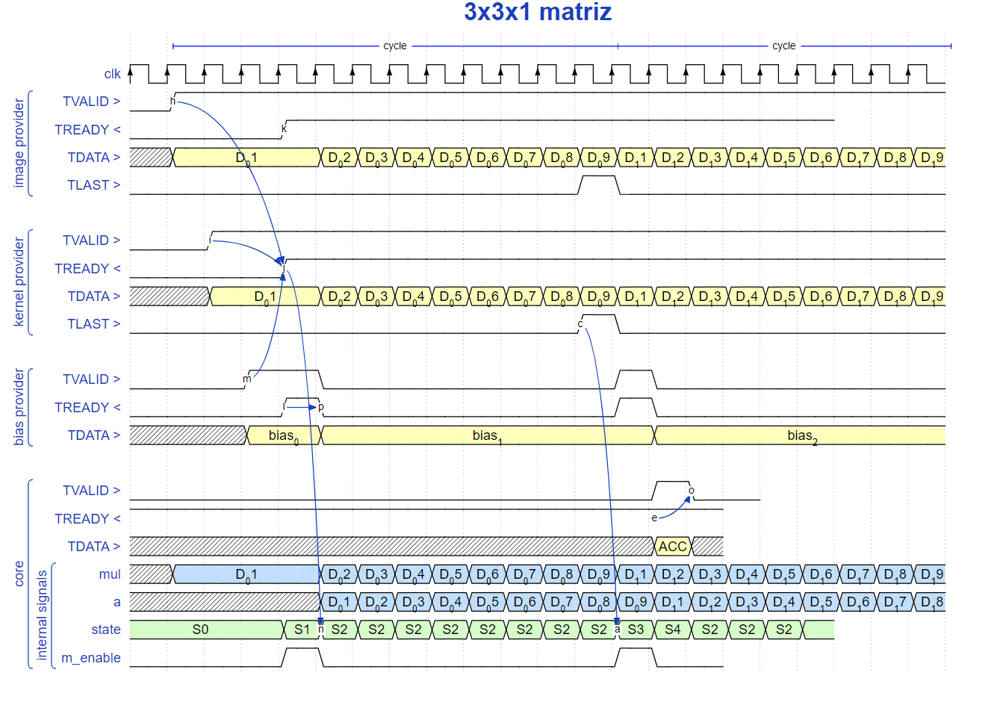

# - nucleo de procesamiento para redes neuronales



# - testing hardware with cocotb

- install dependancies
```bash
cd PATH/TO/REPOSITORY/cocotb
python3 -m venv cocotb_env
source ./cocotb_env/bin/activate
pip install -r requirements
```
- test accumulator
```bash
cd PATH/TO/REPOSITORY/cocotb/examples/accumulator
make
```
- test control unit 
```bash
cd PATH/TO/REPOSITORY/cocotb/examples/control_unit
make
```
- test complete module 
```bash
cd PATH/TO/REPOSITORY/cocotb/examples/core
make
```

# info
need to add this code on your test in order to use `coco_tools` library
```bash
export PYTHONPATH := $(PYTHONPATH):/home/josue/workdir/proyecto-especializacion-final
```

```python
import sys
# sys.path.append(os.path.dirname(os.path.abspath(__file__)))
ruta_modulo = os.path.abspath(os.path.join(os.path.dirname(__file__), '..', '..', 'src'))
sys.path.append(ruta_modulo)
```

# - Exploracion de posibles configuraciones para el DSP
partiendo de la idea que el DSP tiene la siguiente configuracion
$((A+D)*B)+C$, donde la primera suma es el `preadder` y la segunda el `postadder`



se infiere que es posible poner multiplicacion de polinomios tal que se puede obtener una expresion como la siguiente
$$
(a 2^{u} + b 2^{v} + c 2^{w})(d 2^{x} + e 2^{y} + f 2^{z}) = a d 2^{u+x} + a e 2^{u+y} + a f 2^{u+z} + b d 2^{v+x} + b e 2^{v+y} + b f 2^{v+z} + c d 2^{w+x} + c e 2^{w+y} + c f 2^{w+z}
$$

para encontrar las distintas posibles configuraciones, se tiene que editar el archivo `configurations.py` y luego ejecutar
```bash 
python3 temp.py int7_23 
```
donde `int7_23` es el nobre de la configuracion encontrada en el archivo `configurations.py`



## -- int8


## -- int4



## -- int5



# over leaf
```
% =================== SUB-SUB-SECTION
% ====================================== SUB-SECTION
% ============================================================================ SECTION
```

# state diagram
- go to https://wavedrom.com/tutorial.html and just copy the data from `time_diagram_1.js`. 



# - source
### -- links
- [wavedrom](https://wavedrom.com/tutorial.html)
- [axistreamprotocolspec](https://es.slideshare.net/slideshow/ihi0051bambaaxistreamprotocolspecpdf/264642408)
- [cmu.edu/F22/document/slides/lec10.CNN2](https://deeplearning.cs.cmu.edu/F22/document/slides/lec10.CNN2.pdf)
- [gtkwave](https://gtkwave.sourceforge.net/)
- [writing-on-github/working-with-advanced-formatting/writing-mathematical-expressions](https://docs.github.com/en/get-started/writing-on-github/working-with-advanced-formatting/writing-mathematical-expressions)
- [xilinx-machine-learning-strategies](https://www.xilinx.com/publications/events/developer-forum/2018-frankfurt/xilinx-machine-learning-strategies-with-deephi-tech.pdf)
- [introduction-to-model-quantization](https://medium.com/@sachinsoni600517/introduction-to-model-quantization-4effc7a17000)
- [arxiv](https://arxiv.org/pdf/1903.08066) - Trained Quantization Thresholds

### --- youtube
- [youtube](https://www.youtube.com/watch?v=hGkTFa7FSE0)
- [youtube](https://www.youtube.com/watch?v=sc8LOViD0Jg) - quantization

### --- AMD
- [AXI4-Stream-Interface](https://docs.amd.com/r/en-US/pg256-sdfec-integrated-block/AXI4-Stream-Interface)
- [Basic-Handshake](https://docs.amd.com/r/en-US/pg109-xfft/Basic-Handshake)
- [deep-learning-int8](https://docs.amd.com/v/u/en-US/wp486-deep-learning-int8)
- [4bit-optimization](https://docs.amd.com/v/u/en-US/wp521-4bit-optimization)
- [DSP48E1](https://docs.amd.com/v/u/en-US/ug479_7Series_DSP48E1)
- [vivado-properties/USE_DSP](https://docs.amd.com/r/en-US/ug912-vivado-properties/USE_DSP)
## -- books

- Digital Fundamentals ELEVENTH EDITION 
    - Thomas L. Floyd
    - ISBN 10: 1-292-07598-8
        - 2–7 Arithmetic Operations with Signed Numbers

- Efficient Processing of Deep Neural Networks
    - ISBN: 9781681738314 paperback
    - ISBN: 9781681738321 ebook
    - ISBN: 9781681738338 hardcover
        - 7.2.1 QUANTIZATION
        - C H A P T E R 8 Exploiting Sparsity