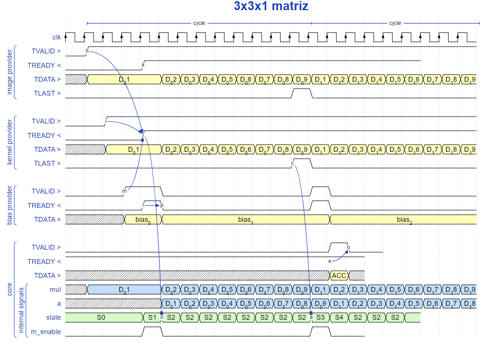

# deploy

- install dependancies
```bash
cd PATH/TO/REPOSITORY/cocotb
python3 -m venv venv
source ./venv/bin/activate
pip3 install -r requirements
```
- test accumulator
```bash
cd PATH/TO/REPOSITORY/cocotb/examples/accumulator
make
```v
- test control unit 
```bash
cd PATH/TO/REPOSITORY/cocotb/examples/control_unit
make
```
- test complete module 
```bash
cd PATH/TO/REPOSITORY/cocotb/examples/core
make
```

# info
need to add this code on your test in order to use `coco_tools` library
```bash
export PYTHONPATH := $(PYTHONPATH):/home/josue/workdir/proyecto-especializacion-final
```

```python
import sys
# sys.path.append(os.path.dirname(os.path.abspath(__file__)))
ruta_modulo = os.path.abspath(os.path.join(os.path.dirname(__file__), '..', '..', 'src'))
sys.path.append(ruta_modulo)
```


# over leaf
```
% =================== SUB-SUB-SECTION
% ====================================== SUB-SECTION
% ============================================================================ SECTION
```

# state diagram
- go to https://wavedrom.com/tutorial.html and just copy the data from `time_diagram_1.js`. 



# source
- https://wavedrom.com/tutorial.html
- https://docs.amd.com/r/en-US/pg256-sdfec-integrated-block/AXI4-Stream-Interface
- https://docs.amd.com/r/en-US/pg109-xfft/Basic-Handshake
- file:///C:/Users/ASUS/Downloads/IHI0051B_amba_axi_stream_protocol_spec.pdf