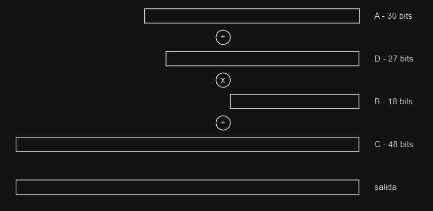
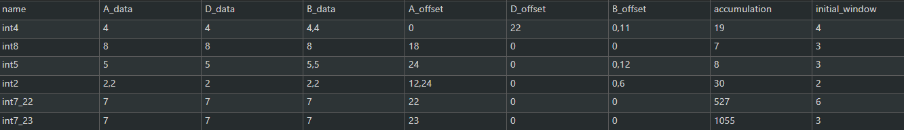
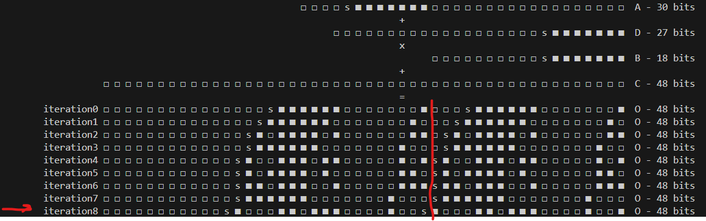
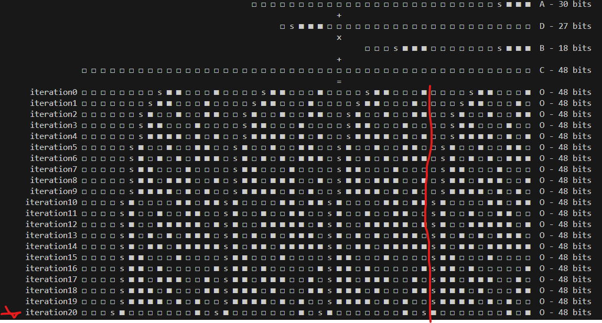
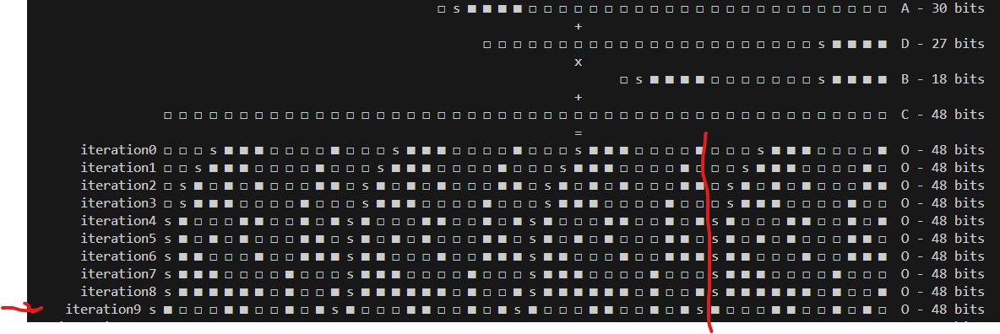

# - Exploracion de posibles configuraciones para el DSP
partiendo de la idea que el DSP tiene la siguiente configuracion
$((A+D)*B)+C$, donde la primera suma es el `preadder` y la segunda el `postadder`



se infiere que es posible poner multiplicacion de polinomios tal que se puede obtener una expresion como la siguiente
$$
(a 2^{u} + b 2^{v} + c 2^{w})(d 2^{x} + e 2^{y} + f 2^{z}) = a d 2^{u+x} + a e 2^{u+y} + a f 2^{u+z} + b d 2^{v+x} + b e 2^{v+y} + b f 2^{v+z} + c d 2^{w+x} + c e 2^{w+y} + c f 2^{w+z}
$$

para encontrar las distintas posibles configuraciones, se tiene que editar el archivo `configurations.py` y luego ejecutar
```bash 
python3 temp.py int7_23 
```
donde `int7_23` es el nobre de la configuracion encontrada en el archivo `configurations.py`



## -- int8


## -- int4



## -- int5


# - deploy

- install dependancies
```bash
cd PATH/TO/REPOSITORY/cocotb
python3 -m venv cocotb_env
source ./cocotb_env/bin/activate
pip install -r requirements
```
- test accumulator
```bash
cd PATH/TO/REPOSITORY/cocotb/examples/accumulator
make
```
- test control unit 
```bash
cd PATH/TO/REPOSITORY/cocotb/examples/control_unit
make
```
- test complete module 
```bash
cd PATH/TO/REPOSITORY/cocotb/examples/core
make
```

# info
need to add this code on your test in order to use `coco_tools` library
```bash
export PYTHONPATH := $(PYTHONPATH):/home/josue/workdir/proyecto-especializacion-final
```

```python
import sys
# sys.path.append(os.path.dirname(os.path.abspath(__file__)))
ruta_modulo = os.path.abspath(os.path.join(os.path.dirname(__file__), '..', '..', 'src'))
sys.path.append(ruta_modulo)
```


# over leaf
```
% =================== SUB-SUB-SECTION
% ====================================== SUB-SECTION
% ============================================================================ SECTION
```

# state diagram
- go to https://wavedrom.com/tutorial.html and just copy the data from `time_diagram_1.js`. 


# source
- https://wavedrom.com/tutorial.html
- https://docs.amd.com/r/en-US/pg256-sdfec-integrated-block/AXI4-Stream-Interface
- https://docs.amd.com/r/en-US/pg109-xfft/Basic-Handshake
- file:///C:/Users/ASUS/Downloads/IHI0051B_amba_axi_stream_protocol_spec.pdf