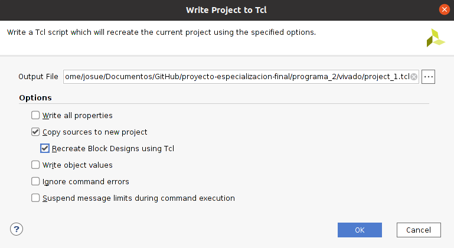

# - Organizacion de carpetas
```
|-- programa_2
    |-- archivos
        |-- project_1_1.tcl
        |-- project_1_2.tcl
        |-- project_1_3.tcl
        |-- project_1_4.tcl
    |-- imagenes
    |-- vivado
    |-- vivado2
    |-- primero.sh
    |-- segundo.sh
    |-- README.md
```
- __vivado__: carpeta que contiene el proyecto oficial
- __vivado2__: carpeta creada para poder guardar los archivos que se importaran al proyecto creado por el TCL. Tiene esta forma porque asi lo requiere el TCL (excepto por la raiz __vivado2__. Este si es un nombre aleatorio)
- __archivos__: Contiene el script. La idea era que tambien contenga a la carpeta __vivado2__ pero por alguna razon me marca error cuando lo hago.
- __primero.sh__: se encarga de crear un __nuevo__ proyecto a partir del archivo TCL que se encuentra en la carpeta __archivos__.
- __segundo.sh__: tiene la misma funcion que darle doble click al icono de __vivado__ en __windows__.
# - Diseño
- Lo primero que hay que hay que hacer es crear el proyecto en __Vivado__. Una vez tengamos el proyecto vamos a esta opcion y descargamos el archivo tcl. Este se guarda en la misma carpeta del proyecto. 

  - _File_
  - _Project_
  - _Write Tcl_



Solo seleccionar las opciones que se indican en la imagen.

- luego copiamos este archivo y lo ponemos en la carpeta __archivos__

- importante: ir al archivo __archivos/project_1.tcl__ y cambiar

```
set origin_dir "*"
```
por
```
set origin_dir "/home/josue/Documentos/GitHub/proyecto-especializacion-final/programa_2/vivado2"
```
- el script __primero.sh__ se encagarga de borrar y crear nuevamente la carpeta __vivado__, asi que no nos preocupemos de eso. Ejecutar estos comandos para que se genere el proyecto en __Vivado__:
```bash
cd (ruta del repo)/programa_2
./primero.sh
```
- en caso quiera usar la GUI, ejecutar los siguientes comandos:
```bash
cd (ruta del repo)/programa_2
./segundo.sh
```
