# Acelerador de Algoritmos de IA
- __Universidad__: Universidad de Buenos Aires (UBA).
- __Curso__: Microarquitectura y softcore.
- __Proyecto__: Sistema acelerador de algoritmo de inteligencia articial. Como premisa se tiene que los datos deben ser obtenidos del exterior. Para este proyecto se uso los botones para simular sensores.
- __Materiales__: ArtyZ7-10, laptop y cable micro-usb.
- __entorno__: Vivado 2020.2 y Vitis 2022.2.
- __hardware description lenguaje__: Verilog.

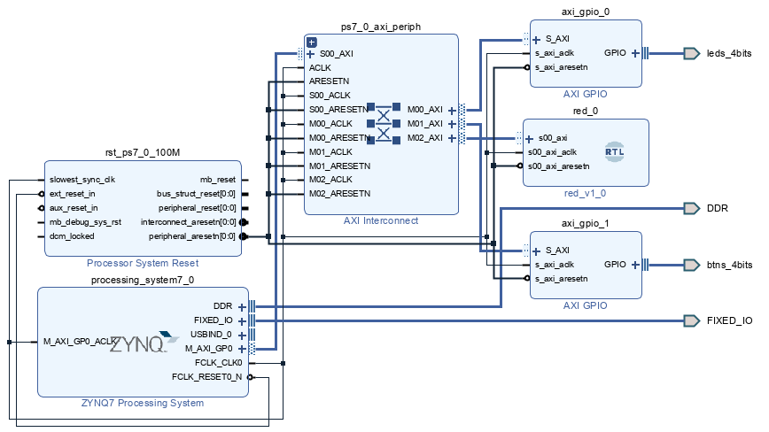

# Diseño
- primero realizamos el diagrama de bloques desde un punto de vista general. Para este caso los pesos son precargados en el hardware.

- la red neuronal tendra la siguiente forma. Por simplicidad no se agrego funcion de activacion pero esto puede ser agregado facilmente.

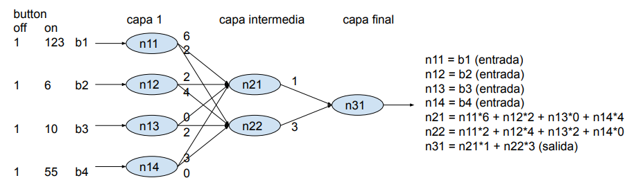

# Implementacion en Vivado

## Red neuronal
nuestra red neuronal consta de tres bloques de hardware: 

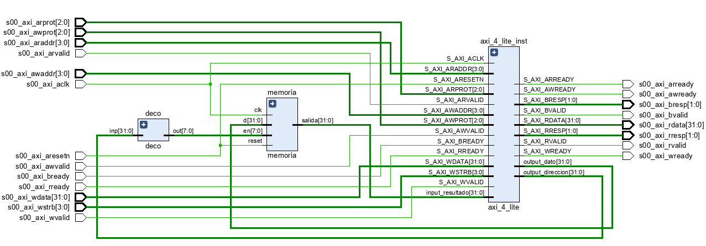

- deco: se usa para poder cargar de forma serial los datos en la capa 1 de la red

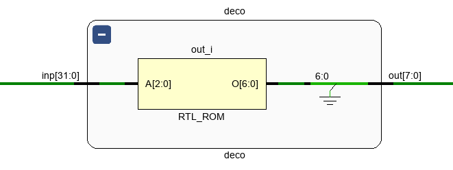

- memoria: contiene la representacion en hardware de las 3 capas.

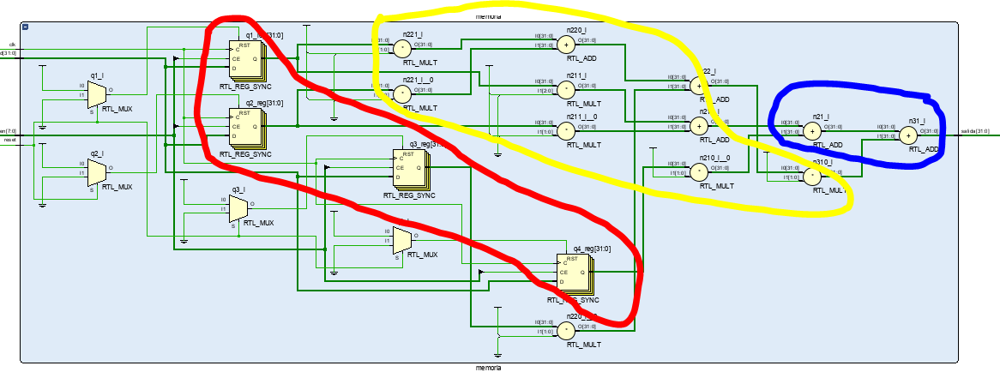

- axi_4_lite_inst: es la interfaz AXI4LITE del hardare. Nos sive para comunicar nuestra red con el procesador. Para poder crearlo usamos el archivo proveido por Vivado y hacemos modificaciones para permitir datos de entrada y salida.
  - Tools
  - Create and Package New IP
  - Next
  - Create a new AXI4 peripheral
  - Next 
  - Next (completar campos de ser necesario)
  - Next
  - Edit IP
  - Finish

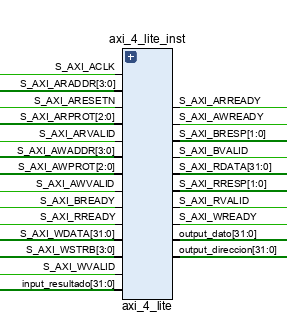

## AXI GPIO button

Se configura el bloque __AXI GPIO__ de la siguiente forma. Al conectarlo al __ZYNQ7__ automaticamente se le asigna la direccion __0x4120_0000__ 

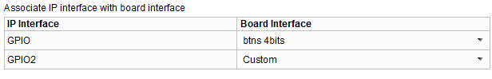

## Bloque completo
Se usan los siguientes bloques en la vista diseño de Vivado:

- ZYNQ7 Processing System (del IP catalog)
- AXI GPIO (del IP catalog para los leds)
- AXI GPIO (del IP catalog para los botones)
- red (diseño propio)
- AXI interconect (creado de manera automatica)
- Processor System Reset (creado de manera automatica)

Dejar que VIvado haga todas las conexiones automaticamente.

Considerar el siguiente direccionamiento AXI4 lite

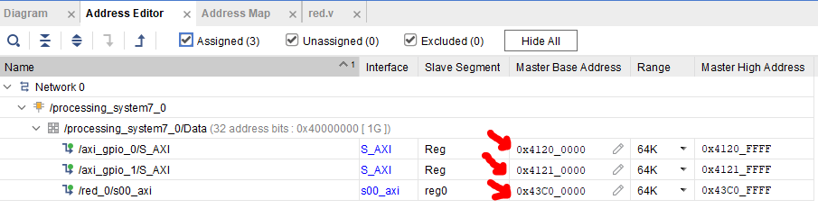

# Implementacion en Vitis
Crear una plataforma y llamarle __plataforma__. Luego crear una desde la plataforma creada y ponerle __aplicacion__

Se usa como proyecto base el brindado por __Vitis__. Seguir la siguiente ruta para crearlo:
- __platform.spr__
- __Board Support Package__ (dentro de folder __standalone on ps7_cortexa9_0__)
- __Import Examples__ (al costado de __axi_gpio_0__)

El software consiste de tres etapas:
- __primera etapa__: se obtiene los datos del exterior. Para este proyecto se uso los botones de la placa para simular un sensor exterior. Se usa a funcion __XGpio_DiscreateRead__ para obtener los datos externos.

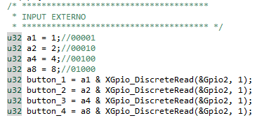
- __segunda etapa__: los datos obtenidos desde el exterior son cargados a un arreglo logico para poder cargarlos a posterior en la red.

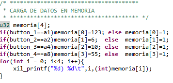
- __Tercera etapa__: Se realiza la alimentacion de la red. Para ello hay que brindarle a la red dos datos: __direccion__ y __dato__.

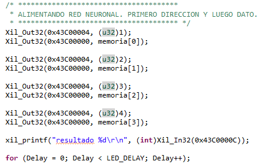

# Uso

Ingresar al entorno de Vitis. Abrir una terminal serial.

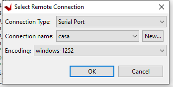

Abrir una terminal. Presionar los botones de la tarjeta ArtyZ7-10

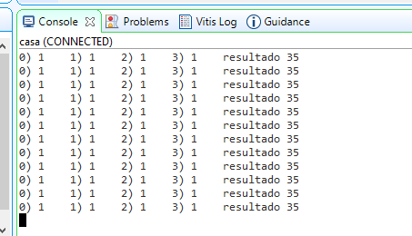

Presionar los botones y veremos que se modica el resultado.

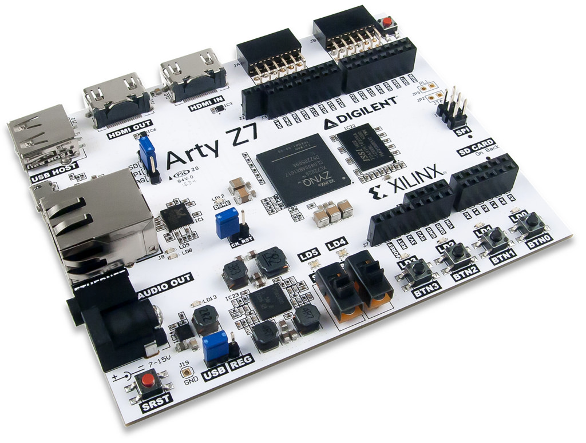
